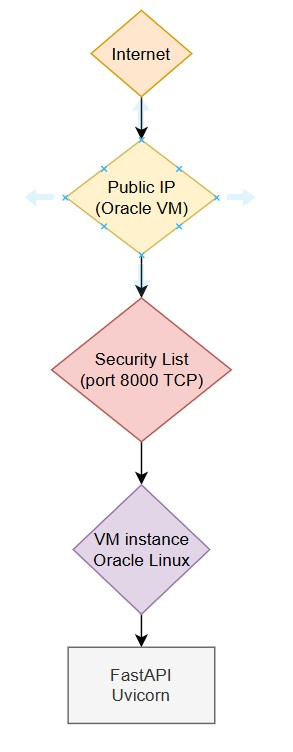
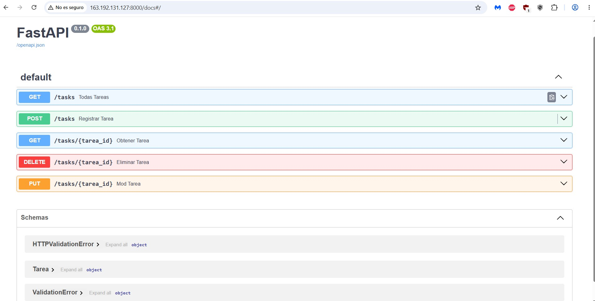

# Task manager API

Rest API developed with FastAPI and deployed on Oracle Cloud Infraestructure using an Oracle VM

## Description
This project is a REST API for task management developed with FastAPI, it allows users to create, retrieve, update and delete tasks. This applications was deployed in Oracle Cloud Infrastructure using a
Oracle Linux compute instance

## Features
* Create task
* Retrieve all tasks or by specific ID
* Modify task by ID
*  Delete tasks
*  Automatic request validation usign Pydantic
*  Interactive documentation using Swagger

## Technologies

* Oracle Cloud Infrastructure
* Python
* FastAPI
* Uvicorn
* Pydantic
* Oracle Linux

## Deployment
This API was deployed in an Oracle Cloud Infrastructure compute instance, using Oracle Linux Virtual Machine. The application is served using Uvicorn and can be accessed through VM public IP. The network access is configured using a VCN with Security List allowing HTTP traffic in port 8000.

**Basic Infraestructure**


**Swagger execution**


**Oracle Cloud Infrastructure**


## Installation
First, in VM instance we create a Virtual Environment with Python
```
python -m venv .venv
source .venv/bin/activate
```
Install the project dependences
```
pip install -r requirements.txt
```
Run the app
```
uvicorn main:app --host 0.0.0.0 --port 8000
```
