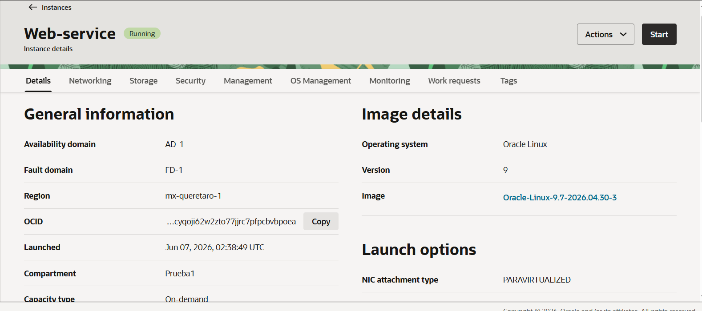

# Task manager API

Rest API developed with FastAPI and deployed on Oracle Cloud Infraestructure Task manager api on Oracle VM

## Description
This project is a RESTAPI task management developed with FastAPI, it allows you to create, retrieve, update and delete tasks. This applications was deployed in Oracle Cloud infraestructure using a
Oracle Linux compute instance

## Technologies

* Oracle Cloud Infraestructure
* Python
* FastAPI
* Uvicorn
* Pydantic
* Oracle Linux

## Deployment
This API was deplyed in an Oracle Cloud Infraestructure compute instance, using Oracle Linux Virtual Machine. The application is served using Uvicorn and can be accecessed through VM public IP. The network access is configured using a VCN with Security List allowing HTTP trafic in port 8000.

**Basic Infraestructure**

**Swagger execution**

**Oracle Cloud Infraestructure**

