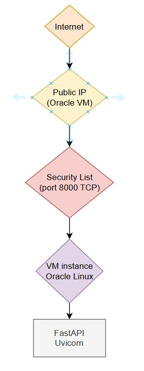
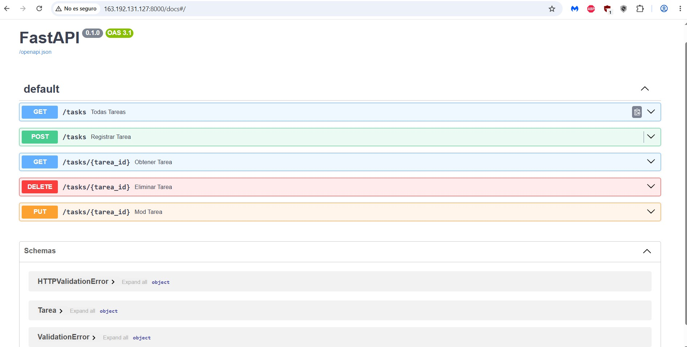
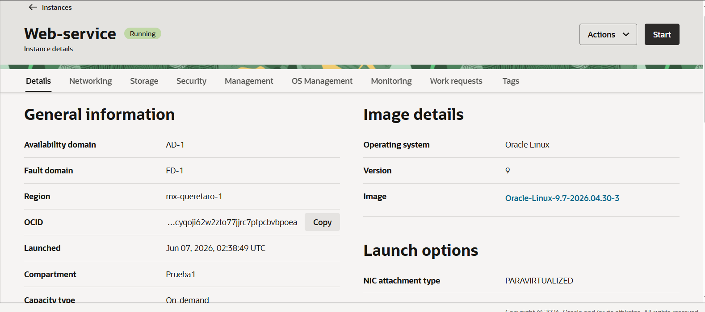

# Task manager API

Rest API developed with FastAPI and deployed on Oracle Cloud Infraestructure using an Oracle VM

## Description
This project is a REST API for task management developed with FastAPI, it allows users to create, retrieve, update and delete tasks. This applications was deployed in Oracle Cloud Infrastructure using a
Oracle Linux compute instance

## Features
* Create task
* Retrieve all tasks or by specific ID
* Modify task by ID
*  Delete tasks
*  Automatic request validation usign Pydantic
*  Interactive documentation using Swagger

## Technologies

* OCI - Oracle Autonomous Database
* Python
* Docker
* Swagger
* FastAPI
* Uvicorn
* Pydantic
* Oracle Linux

## Deployment
This API was deployed in an Oracle Cloud Infrastructure compute instance, using Oracle Linux Virtual Machine. The application is served using Uvicorn and can be accessed through VM public IP. The network access is configured using a VCN with Security List allowing HTTP traffic in port 8000.

**Basic Infraestructure**


**Swagger execution**


**Oracle Cloud Infrastructure**



## Docker

This proyect can be excecuted inside a Docker container.

Docker is used to:

* Package the Python application and its dependencies.
* Provide a consistent execution environment.
* Include the required Oracle client configuration.
* Run the FastAPI application using Uvicorn.

In this case I used the Database Wallet to connect with Database and include **Thick** client for Oracle.

Swagger documentation can be acceded at

http://127.0.0.1:8000/docs

## Security considerations

### SQL Params

This app uses parametrized SQL queries with Oracle bind variables
```
cursor.execute(
    """ SELECT * FROM TAREAS WHERE TAREA_ID = :tareaid """, 
    { "tareaid": tarea_id } 
    )
```

Bind varibles prevent the user input as part of SQL query and protect the app against **SQL inyection**.


## Running project
### Local

Install the project dependencies:

```
pip install -r requirements.txt
```

Run the API:
```
uvicorn main:app --reload
```

Then open Swagger documentation:

http://localhost:8000/docs

### Docker

Create Docker image
```
Docker build -t task-manager-api .
```
Run the container
```
Docker run --env-file .env
```

Database credential must be provided according to the project's enviroment configuration. Sensitive information such a Oracle Wallet not inlcuded in the repository

## Cloud enviroment

The database used was hosted on Oracle Cloud Infrastructure (OCI) using Oracle Autonomous Database.

This project provided hands-on experience with:

Cloud database connectivity
Oracle Wallet configuration
OCI resources
API deployment concepts
Docker containerization
Secure handling of database credentials